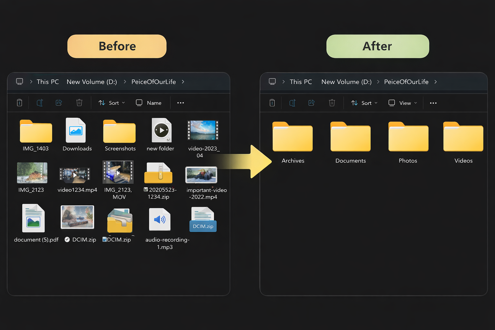
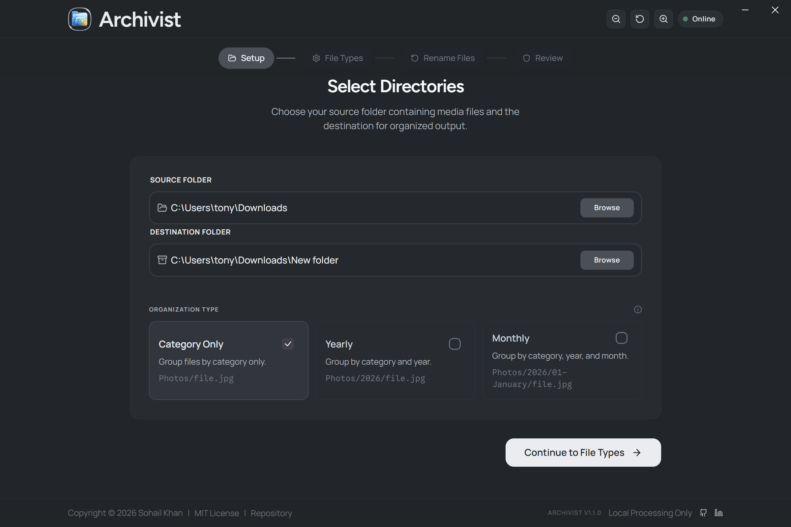
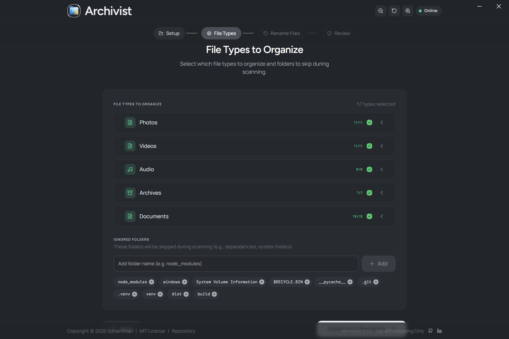
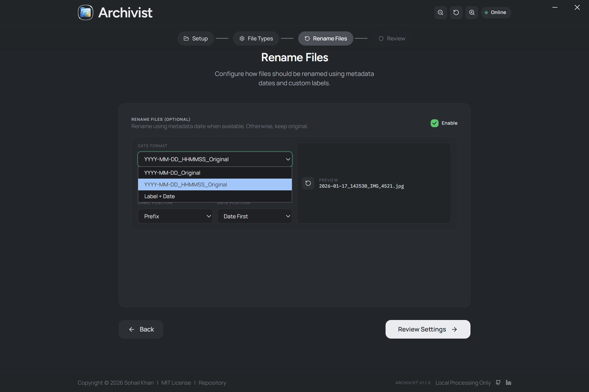
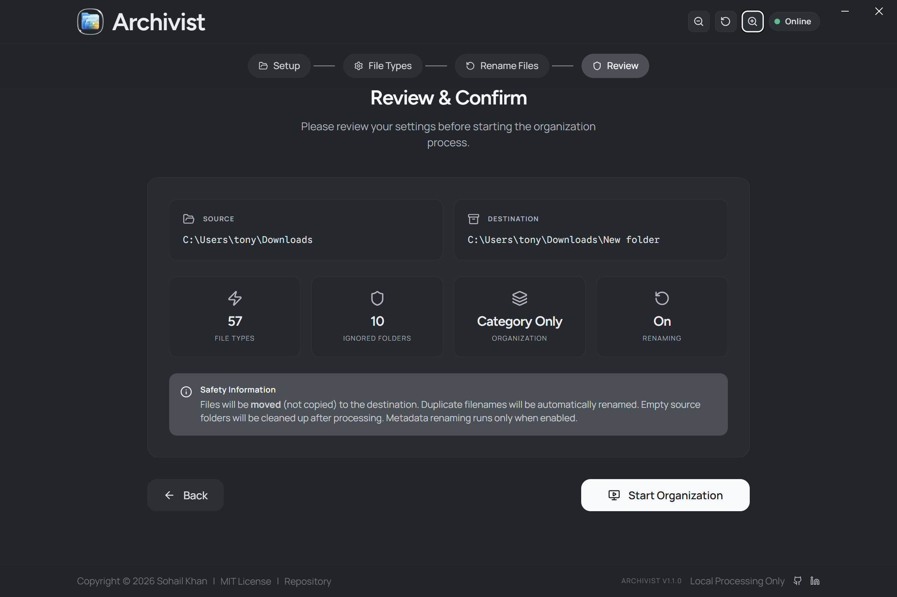
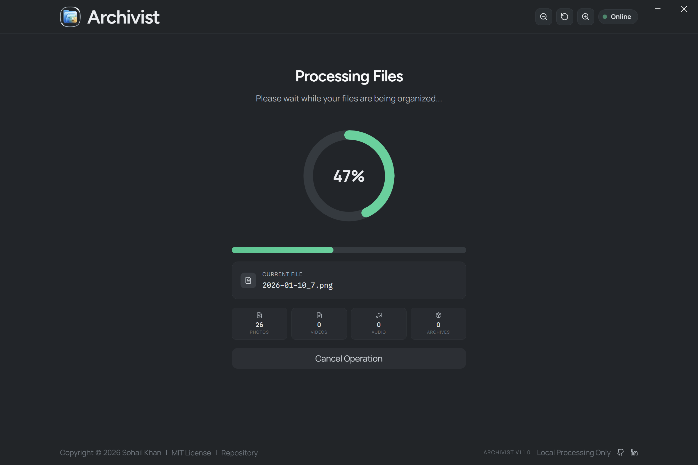
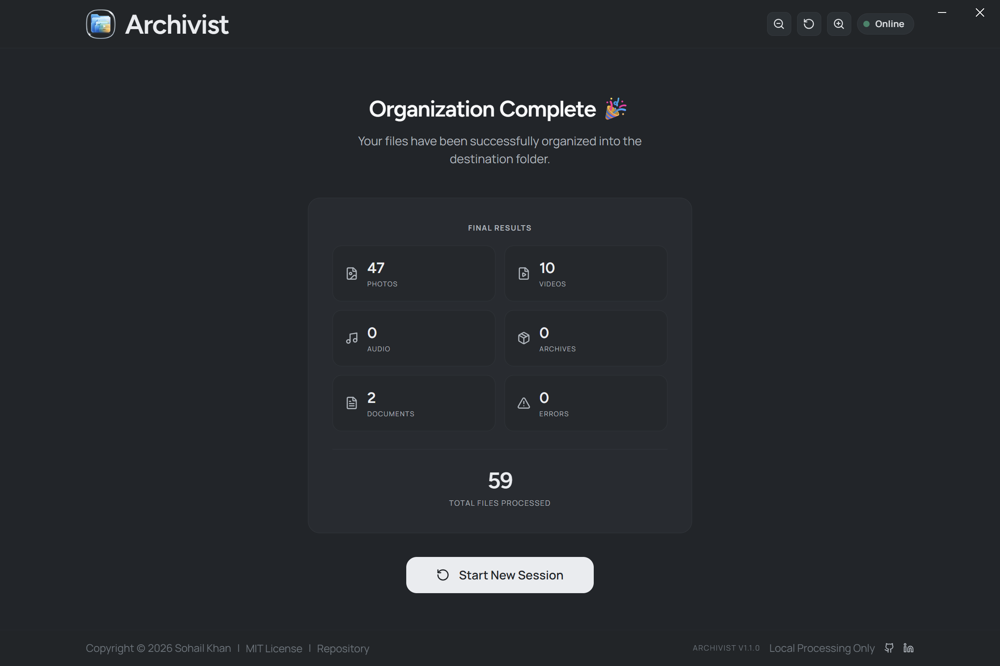

  

  <h1>Archivist</h1>

  

    <strong>A local-first media organizer that sorts photos, videos, audio, archives, and documents into a clean folder structure.</strong>
     
    Runs with a React + Electron UI and a FastAPI backend, keeping all processing securely on your machine.
  

  

    <!-- Badges -->
    
    
    
  

  

    <a href="#download">Download</a> •
    <a href="#features">Features</a> •
    <a href="#tech-stack">Tech Stack</a> •
    <a href="#contributing">Contributing</a>
  

 

## Why Archivist?

Bringing order to your digital chaos with a privacy-first approach.

- 🔒 **Local-First Processing**: No uploads, everything stays on your machine.
- 📂 **Smart Organization**: Automatically categorizes files by type, year, and month.
- ⚡ **Modern Stack**: Built with React, Electron, and a robust FastAPI backend.
- 🏷️ **Metadata Power**: Uses file creation dates and metadata for accurate sorting.

---

## Download

<a href="https://github.com/MeetSohailCodes/Archivist/releases/tag/v1.0" style="display: inline-flex; align-items: center; text-decoration: none; height:40px; background-color: #0078D4; color: white; padding: 0 16px; border-radius: 6px;">
  
  <b>Download for Windows</b>
</a>

---

## Screenshots

**App Overview**

**Sample Workflow**

| Step | Screenshot |
|------|:----------|
| 1    |            |
|      | ⏬                                           |
| 2    |          |
|      | ⏬                                           |
| 3    |          |
|      | ⏬                                           |
| 4    |          |
|      | ⏬                                           |
| 5    |          |
|      | ⏬                                           |
| 6    |          |

## Features
- Organize by category, year, or month
- Optional metadata-based renaming with label and date strategies
- File type filters and ignored folder controls
- Live progress updates and basic stats
- Local-only processing (no uploads)

## Tech Stack
- Frontend: React, Vite, Tailwind CSS, HeroUI, Framer Motion
- Backend: FastAPI, Uvicorn, Pillow
- Desktop shell: Electron

## Quick Start (Dev)
1) Install root dependencies:
   - `npm install`
2) Install frontend dependencies:
   - `cd frontend && npm install`
3) Install backend dependencies:
   - `python -m venv backend/venv`
   - `backend/venv/Scripts/pip install -r backend/requirements.txt`
4) Start the backend:
   - `python backend/main.py`
5) Start the frontend:
   - `cd frontend && npm run dev`

Optional: run the Electron shell (expects the backend to be running):
- `npm run dev`

## Build
- Frontend build: `npm run build:frontend`
- Backend build (Windows): `npm run build:backend`
- Full package: `npm run dist`

## Configuration
Update product metadata and links in:
- `frontend/src/config/index.config.ts`

## Screenshot Notes
The screenshot is a placeholder. Replace `docs/screenshots/app-preview.svg` with your real screenshot while keeping the same filename, or update the README image path.

## Contributing
See `CONTRIBUTING.md`.

## Security
See `SECURITY.md`.

## License
MIT. See `LICENSE`.
