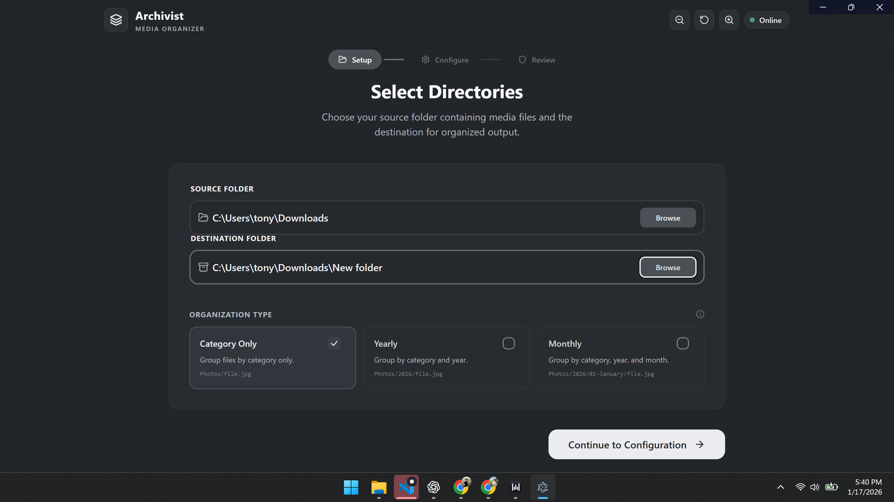
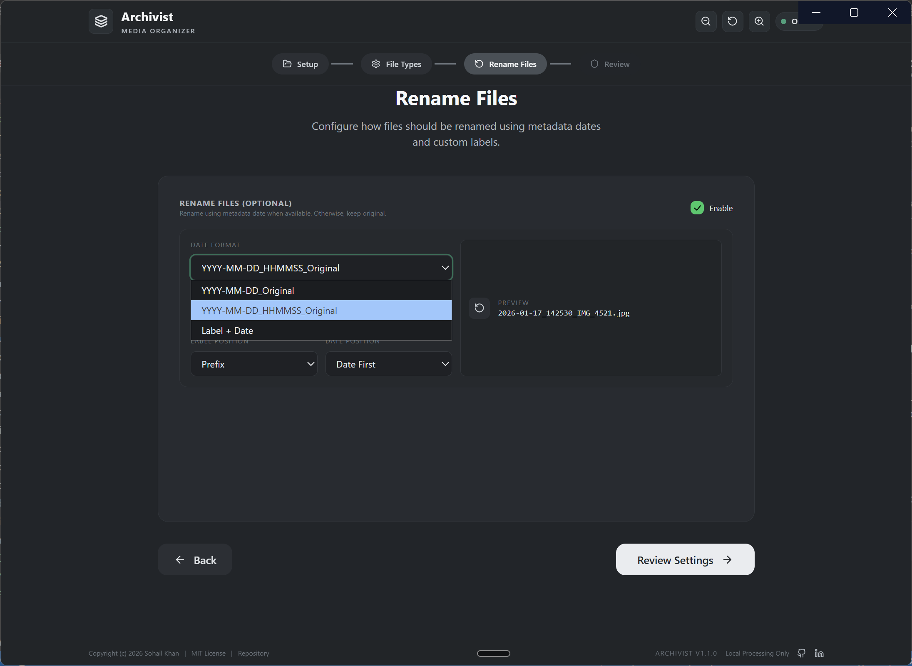
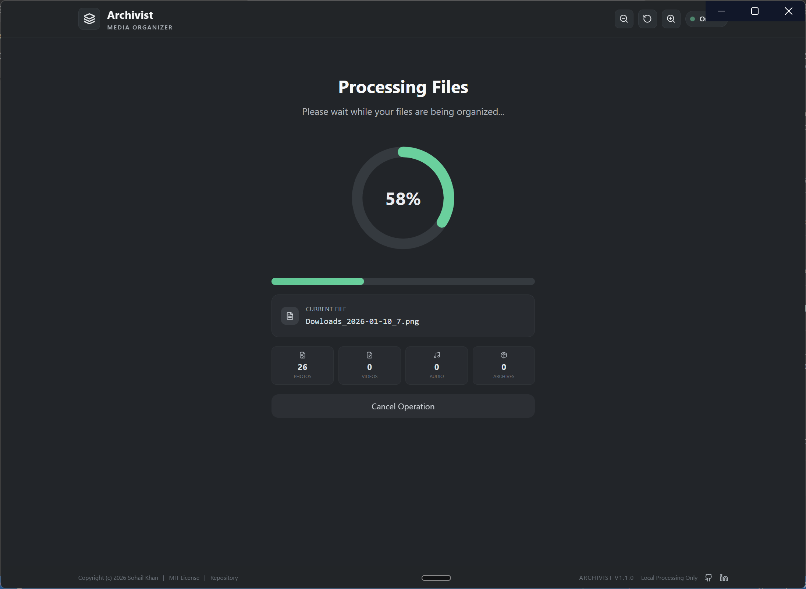
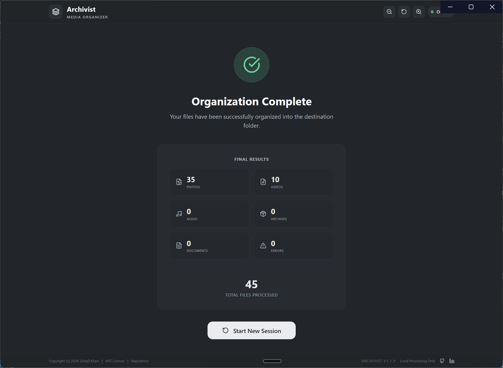

# Archivist

Archivist is a local-first media organizer that sorts photos, videos, audio, archives, and documents into a clean folder structure. It runs with a React + Electron UI and a FastAPI backend, and it keeps all processing on your machine.

## Features
- Organize by category, year, or month
- Optional metadata-based renaming with label and date strategies
- File type filters and ignored folder controls
- Live progress updates and basic stats
- Local-only processing (no uploads)

## Tech Stack
- Frontend: React, Vite, Tailwind CSS, HeroUI, Framer Motion
- Backend: FastAPI, Uvicorn, Pillow
- Desktop shell: Electron

## Quick Start (Dev)
1) Install root dependencies:
   - `npm install`
2) Install frontend dependencies:
   - `cd frontend && npm install`
3) Install backend dependencies:
   - `python -m venv backend/venv`
   - `backend/venv/Scripts/pip install -r backend/requirements.txt`
4) Start the backend:
   - `python backend/main.py`
5) Start the frontend:
   - `cd frontend && npm run dev`

Optional: run the Electron shell (expects the backend to be running):
- `npm run dev`

## Build
- Frontend build: `npm run build:frontend`
- Backend build (Windows): `npm run build:backend`
- Full package: `npm run dist`

## Configuration
Update product metadata and links in:
- `frontend/src/config/index.config.ts`

## Screenshot Notes
The screenshot is a placeholder. Replace `docs/screenshots/app-preview.svg` with your real screenshot while keeping the same filename, or update the README image path.

## Contributing
See `CONTRIBUTING.md`.

## Security
See `SECURITY.md`.

## License
MIT. See `LICENSE`.
